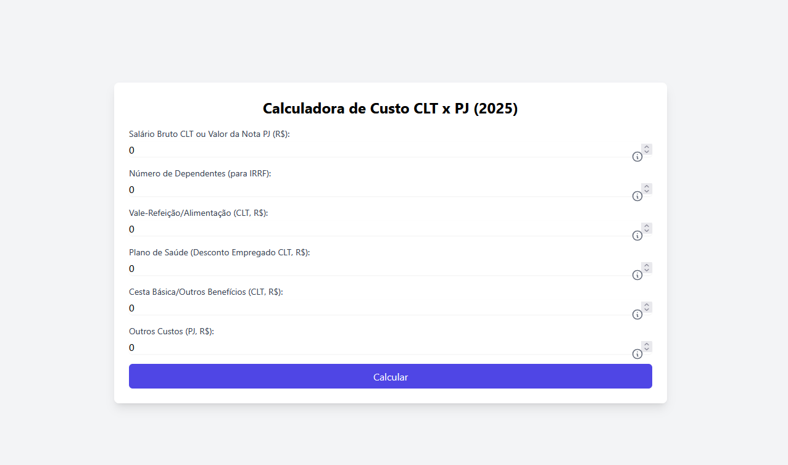

# 💼 Calculadora CLT x PJ (2025)

Uma calculadora interativa e acessível para comparar custos e rendimentos entre contratações **CLT** e **PJ** no Brasil, com base nas regras de 2025. Ideal para empregadores, funcionários e prestadores de serviço que querem entender o impacto financeiro de cada regime.

 <!-- Substitua por uma captura real da interface -->

[](https://opensource.org/licenses/MIT)
[](https://caniuse.com)

---

## 🎯 Funcionalidades

- **Cálculos Detalhados**:
  - **CLT**: INSS, IRRF, FGTS, vale-transporte, vale-refeição, plano de saúde, férias, 13º e encargos patronais.
  - **PJ**: Impostos Simples Nacional (6%), INSS pró-labore, custo de contabilidade e outros custos personalizados.
- **Comparativo Claro**: Valor líquido recebido e custo total para o contratante.
- **Interface Intuitiva**:
  - Ajuda contextual com modais ativados por clique/toque 🛈.
  - Validação de entradas com mensagens de erro.
  - Botão "Voltar ao Topo" para navegação em dispositivos móveis.
- **Responsividade**: Layout otimizado para desktops e dispositivos móveis.
- **Acessibilidade**:
  - Suporte a leitores de tela (ARIA labels, descrições).
  - Navegação por teclado (Tab, Enter, Esc).
  - Foco visível em elementos interativos.

---

## 🚀 Como Usar

### Pré-requisitos
- Navegador moderno (Chrome, Firefox, Safari, Edge).
- Conexão à internet (para carregar Tailwind CSS e Heroicons via CDN).
- Nenhum servidor ou dependências locais são necessários.

### Passos
1. Clone o repositório:
   ```bash
   git clone https://github.com/manuseiro/calculadora-clt-pj.git
   ```
2. Navegue até o diretório:
   ```bash
   cd calculadora-clt-pj
   ```
3. Abra o arquivo `index.html` em um navegador:
   - No Windows: clique duplo em `index.html`.
   - No macOS/Linux: `open index.html` ou arraste para o navegador.
4. Preencha os campos (ex.: salário, benefícios) e clique em "Calcular" para ver os resultados.

> **Dica**: Para testar em dispositivos móveis, use o modo responsivo do DevTools ou hospede em [GitHub Pages](#demo).

---

## 🖼️ Exemplo de Resultado

**Entradas**:
- Salário Bruto/Nota Fiscal: R$ 5.000,00
- Vale-Refeição: R$ 600,00
- Plano de Saúde: R$ 200,00
- Cesta Básica: R$ 300,00
- Outros Custos (PJ): R$ 100,00

**Saída**:
- **CLT**:
  - Salário Líquido: R$ 3.443,12
  - Custo Total Empregador: R$ 9.172,23
- **PJ**:
  - Valor Líquido: R$ 4.231,59
  - Custo Total Empregador: R$ 5.000,00
- **Comparativo**:
  - 💡 Como PJ, você recebe **R$ 788,47 a mais** por mês.
  - 💰 O custo para o contratante é **R$ 4.172,23 menor** no regime PJ.

---

## 🧠 Lógica de Cálculo

### CLT
- **INSS**: Faixas de 7,5% a 14%, até o teto de R$ 8.157,41 (2025).
- **IRRF**: Alíquotas de 0% a 27,5%, com dedução de R$ 211,20 por dependente.
- **Vale-Transporte**: Desconto de 6% (empregado) + 10% (empregador, estimado).
- **Vale-Refeição**: Desconto de 20% (empregado).
- **Plano de Saúde**: Empregador paga 2x o desconto do empregado (estimado).
- **Encargos**: FGTS (8%), INSS patronal (20%), provisão de 13º, férias e 1/3 constitucional.

### PJ
- **Impostos**: Simples Nacional (6%, Anexo III, faixa inicial).
- **INSS Pró-Labore**: 11% sobre o mínimo de R$ 1.531 (2025).
- **Contabilidade**: Estimativa de R$ 200/mês.
- **Outros Custos**: Valor personalizado informado pelo usuário.

---

## 📦 Tecnologias Utilizadas

- **HTML5** e **JavaScript ES6+**: Estrutura e lógica do frontend.
- **Tailwind CSS (CDN)**: Estilização responsiva e moderna.
- **Heroicons (CDN)**: Ícones para interface e ajuda.
- **Intl.NumberFormat**: Formatação monetária em R$ (pt-BR).

---

## 🌐 Demonstração

Experimente a calculadora ao vivo: [Link para Demo](#) <!-- Substitua por um link real, ex.: GitHub Pages -->

---

## 🤝 Contribuindo

Adoraríamos sua ajuda para melhorar este projeto! Siga os passos abaixo:

1. Faça um fork do repositório.
2. Crie uma branch para sua feature:
   ```bash
   git checkout -b minha-feature
   ```
3. Commit suas mudanças:
   ```bash
   git commit -m "Adiciona minha feature"
   ```
4. Envie para o repositório remoto:
   ```bash
   git push origin minha-feature
   ```
5. Abra um Pull Request descrevendo suas alterações.

**Dicas**:
- Verifique a acessibilidade com ferramentas como [WAVE](https://wave.webaim.org/) ou [Lighthouse](https://developers.google.com/web/tools/lighthouse).
- Teste em navegadores diferentes e dispositivos móveis.
- Abra issues para bugs ou sugestões antes de começar.

---

## 📋 To-do (Melhorias Futuras)

- [ ] Adicionar modo escuro com alternância automática (prefers-color-scheme).
- [ ] Implementar exportação de resultados em PDF/CSV.
- [ ] Suporte a gestos de swipe para tabelas em dispositivos móveis.
- [ ] Adicionar gráficos comparativos com Chart.js.
- [ ] Permitir configuração de percentuais (ex.: desconto de vale-refeição).
- [ ] Salvar cálculos recentes com localStorage.

---

## 🧑‍💻 Autor

Desenvolvido por **[Manuseiro]**    
💼 LinkedIn: [linkedin.com/in/manuseiro](https://linkedin.com/in/manuseiro)  
🌐 GitHub: [github.com/manuseiro](https://github.com/manuseiro)

> Quer personalizar este README com seus dados? Informe seu nome, email, LinkedIn e GitHub, e gerarei uma versão pronta!

---

## 🙏 Agradecimentos

- [Tailwind CSS](https://tailwindcss.com/) por facilitar a estilização responsiva.
- [Heroicons](https://heroicons.com/) pelos ícones modernos.
- Comunidade open-source por inspiração e feedback.

---

## 📝 Licença

Este projeto está licenciado sob a [MIT License](LICENSE).

---

⭐ **Gostou do projeto? Dê uma estrela no GitHub e compartilhe com quem precisa!**